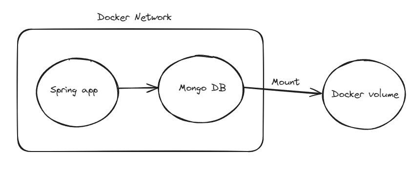

# Docker Application Deployment Showcase

## Introduction

This repository demonstrates the setup of two Docker containers to run an application and a database. Below are the details of each component:

- **Application Container**: This container hosts the application code.
- **Database Container**: This container hosts the database required for the application.

## Docker Components

- **Docker Network**: A custom Docker network has been created to allow communication between the application and the database containers.
- **Docker Volume**: A Docker volume has been created to persist the data of the database container.

## Architecture Overview

